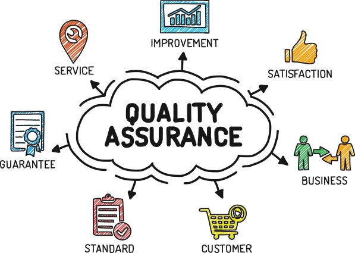

# armands.avotins
## Kas es esmu?
Esmu programmatūras testētājs jau vairāk kā 4 gadus, ar pieredzi gan manuālajā, gan automatizētajā testēšanā.
Darba gaitas IT uzsāku kā praktikants - testētājs, šobrīd esmu vecākais testēšanas speciālists.
Pieredze galvenokārt "public sector" projektos.
Pieredze  Agile/Scrum/Waterfall tipa projektos.

Ir pieredze biznesa analīzē, darbā ar klientiem, prasību specificēšanu,  prototipu izstrādi, dokumentācijas/rokasgrāmatu rakstīšanu, u.t.t, bet QA/ testēšana  personīgi patīk labāk.

## Kāpēc vērts uzsākt karjeru IT ar QA/testēšanu?

Manuprāt, testēšana ir lielisks atspēriena solis, lai uzsāktu karjeru IT, jo prasības pēc tehniskajām zināšanām ir zemākas, nekā, piemēram, programmēšanā.
Ar programmēšanu šeit domāts kas vairāk, par if/else, cikliem, vienkāršu datu struktūru un algoritmu izmantošanu, jo konkrētos projektos ir konkrēta specifika, bez pieredzes un zināšanām darbā ar jebkādu "tech stack", ir daudz grūtāk uzsākt darbu.

Uzsākot darbu kā testētājam, ir iespēja iepazīties ar programmatūras izstrādi, iegūt tehniskās zināšanas, un kādu laiku aktīvi darbojoties iespējams daudz labāk saprast to, ar ko ir vēlme turpināt nodarboties IT jomā - iespēju ir daudz.
Parasti ieguldot papildus laiku mācoties sevis izvēlēto virzienu, ir iespējams uzņēmuma iekšienē atrast kādu atvērtu pozīciju citā junior/associate līmenī.


Uzsākot testēšanas/ QA gaitas, ir noderīga mājaslapa, kurā iespējams atrast info, saistībā ar testēšanu -
[Guru 99.com](https://www.guru99.com/software-testing.html)

Random citāts, saistībā ar programmatūras izstrādi un testēšanu:

```All code is guilty until proven innocent. ```

Tests git virsrakstu leveliem
### level 3
#### level 4
##### level 5
###### level6
####### level7

